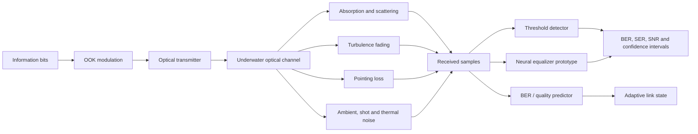

<div align="center">

# OpenUWOC-AI

## Simulation-First Artificial Intelligence for Underwater Optical Wireless Communication

A reproducible Python research framework for physics-informed UWOC simulation, classical receiver baselines, prototype neural receivers, and adaptive link-quality reasoning.

[](pyproject.toml)
[](#research-problem)
[](#verified-scope)
[](LICENSE)

**English** · [Ελληνικά](README_GR.md)

</div>

<p align="center">
  
</p>

<p align="center"><em>Conceptual overview of the repository. The diagram describes the simulation and evaluation pipeline; it is not tank, sea-trial, hardware-in-the-loop, or deployment evidence.</em></p>

## Abstract

Underwater optical wireless communication (UWOC) offers the possibility of high-data-rate and low-latency links for marine robots and underwater sensor networks, but its reliability is strongly affected by absorption, scattering, turbulence, pointing misalignment, ambient illumination, and receiver noise. OpenUWOC-AI studies whether data-driven receivers and link-quality predictors can improve robustness under these interacting impairments while remaining comparable to transparent physical and classical baselines.

The repository combines a modular underwater optical-channel simulator, deterministic experiment configurations, on-off keying, threshold detection, finite-sample communication metrics, and prototype PyTorch models for neural equalization and BER prediction. Its primary contribution is not a claim of superior AI performance, but a traceable experimental scaffold in which physical assumptions, random seeds, receiver choices, metrics, and generated artifacts remain explicit.

All current results are **simulation-only**. The repository does not claim calibrated physical-channel parameters, tank or sea-trial validation, production readiness, or state-of-the-art performance.

---

## Research problem

> **How can classical and data-driven receivers preserve reliable UWOC links under changing water conditions, distance, turbulence, platform motion, optical background, and incomplete channel knowledge?**

A useful answer requires three levels of reasoning:

1. **Physical propagation:** What signal reaches the receiver after attenuation, fading, pointing loss, and noise?
2. **Receiver inference:** How should the transmitted symbols be reconstructed from degraded observations?
3. **Link adaptation:** When should the communication system change receiver, modulation, optical power, or mission policy?

OpenUWOC-AI focuses on the first two levels and provides prototype interfaces for the third.

---

## Why underwater optical communication is difficult

UWOC performance may degrade through:

- wavelength-dependent absorption;
- particle scattering and turbidity;
- turbulence-induced irradiance fluctuations;
- AUV or ROV motion and pointing misalignment;
- ambient optical background;
- shot and thermal receiver noise;
- receiver bandwidth and nonlinearities;
- mismatch between simulated and physical water conditions.

A neural receiver is scientifically meaningful only when evaluated against strong classical baselines using identical transmitted bits, channel conditions, random seeds, and metric definitions.

---

## System architecture



The repository intentionally separates physical-channel modeling, receiver inference, and evaluation so each component can be replaced or ablated independently.

---

## Mathematical formulation

The baseline assumes intensity modulation with direct detection. A received sample is modeled as

```math
y_k = h_k P_t[k] + P_{amb} + n_{shot,k} + n_{th,k},
```

with effective gain

```math
h_k = \exp[-(a(\lambda)+b(\lambda))d]h_p(k)h_t(k).
```

Here:

- `a(λ)` is the absorption coefficient;
- `b(λ)` is the scattering coefficient;
- `d` is link distance;
- `h_p(k)` is pointing loss;
- `h_t(k)` is turbulence fading;
- `P_amb` is ambient optical power;
- `n_shot,k` and `n_th,k` represent receiver-noise terms.

For transmitted bits `b_k` and decisions `b̂_k`, the bit error rate is

```math
\mathrm{BER}=\frac{1}{N}\sum_{k=1}^{N}\mathbf{1}[b_k\neq\hat b_k].
```

Finite trials should report confidence intervals rather than a point estimate alone. The current evaluation utilities include Wilson intervals.

---

## Research contributions

| Contribution | Current role |
|---|---|
| Modular physical-channel simulation | Separates attenuation, turbulence, pointing loss, ambient light, and receiver noise |
| Deterministic experiments | YAML configurations, explicit random seeds, and CSV outputs |
| Classical receiver baseline | OOK modulation with transparent threshold detection |
| Statistical evaluation | BER, SER, approximate SNR, and Wilson confidence intervals |
| Neural equalizer prototype | Small PyTorch MLP for controlled comparisons |
| BER / quality predictor prototype | Data-driven interface for future link adaptation |
| Generated research artifacts | Figures, GIF, video, and tabular outputs produced from code |
| Claim-disciplined documentation | Explicit distinction among implemented, prototype, planned, and physically unvalidated components |

---

## Verified scope

| Area | Status | Evidence boundary |
|---|---:|---|
| Beer–Lambert attenuation | Implemented | Simulation model |
| Clear, coastal, and turbid water presets | Implemented | Configured coefficients, not field calibration |
| Pointing-error model | Implemented | Gaussian-loss scaffold |
| Turbulence model | Prototype | Unit-mean lognormal scaffold |
| Thermal and shot noise | Implemented | Receiver-noise approximation |
| OOK and threshold detector | Implemented | Classical synthetic baseline |
| BER, SER, SNR, Wilson interval | Implemented | Finite synthetic trials |
| YAML experiment runner | Implemented | Deterministic configuration and CSV export |
| Neural equalizer | Prototype | Small PyTorch model |
| BER predictor | Prototype | Small PyTorch model |
| Adaptive modulation / power control | Planned / prototype interface | No validated policy claim |
| BPSK, QPSK, QAM, OFDM | Planned | Not implemented as reportable baselines |
| Tank, pool, or sea-trial data | Not available | No physical validation claim |
| Hardware-in-the-loop link | Planned | Transmitter/receiver integration pending |

---

## Installation

```bash
git clone https://github.com/panagiotagrosdouli/OpenUWOC-AI.git
cd OpenUWOC-AI
python -m venv .venv
source .venv/bin/activate
python -m pip install --upgrade pip
python -m pip install -e ".[dev]"
```

Install the optional PyTorch prototypes:

```bash
python -m pip install -e ".[ai]"
```

Windows PowerShell activation:

```powershell
.venv\Scripts\Activate.ps1
python -m pip install -e ".[dev]"
```

---

## Quick start

```python
from openuwoc_ai.channel.models import ChannelConfig, UnderwaterOpticalChannel, WaterType
from openuwoc_ai.evaluation.metrics import bit_error_rate
from openuwoc_ai.modulation.ook import bits_to_ook, random_bits, threshold_detect

bits = random_bits(1000, seed=7)
tx = bits_to_ook(bits, optical_power_w=1.0)
channel = UnderwaterOpticalChannel(
    ChannelConfig(water_type=WaterType.COASTAL, distance_m=10.0)
)
rx = channel.propagate(tx)
estimated = threshold_detect(rx)
print(bit_error_rate(bits, estimated))
```

Run the documented experiment:

```bash
python scripts/run_experiment.py \
  configs/coastal_ook_baseline.yaml \
  --output results/coastal_ook_baseline.csv
```

Run tests and generate media:

```bash
pytest
python scripts/make_demo_gif.py
```

Expected generated outputs include:

```text
assets/demo.gif
results/videos/demo.mp4
results/*.csv
```

Generated media are illustrative simulation artifacts, not physical measurements.

---

## Experimental protocol

A rigorous comparison should vary controlled factors such as:

| Factor | Example conditions |
|---|---|
| Water type | clear ocean, coastal, turbid harbor |
| Distance | short to strongly attenuated links |
| Optical power | controlled transmitter-power sweep |
| Turbulence | weak to stronger fading parameters |
| Misalignment | pointing displacement or variance |
| Ambient light | low to high optical background |
| Receiver noise | thermal and shot-noise levels |
| Receiver | threshold, classical equalizer, neural equalizer |

Every reported experiment should preserve:

- configuration file;
- random seed;
- transmitted-bit sequence or generation seed;
- number of transmitted symbols;
- receiver method and hyperparameters;
- software revision;
- output tables and figures;
- uncertainty or confidence interval for finite trials.

---

## Evaluation dimensions

| Category | Metrics |
|---|---|
| Reliability | BER and SER |
| Signal quality | approximate SNR and received-power summaries |
| Statistical confidence | Wilson interval for finite-bit experiments |
| Robustness | degradation across water, distance, turbulence, noise, and pointing error |
| Receiver comparison | gain or loss relative to identical classical baselines |
| Generalization | performance under unseen channel conditions |
| Deployment research | inference latency, memory, parameter count, and energy when measured |

An AI receiver should not be described as better unless it is compared on identical bits and channel realizations against meaningful classical receivers.

---

## Repository structure

```text
openuwoc_ai/        channel, modulation, receiver and evaluation modules
configs/            reproducible experiment configurations
scripts/            experiment and media entry points
tests/              automated unit and regression tests
docs/               formulation, assumptions and research documentation
assets/              explanatory and generated visual assets
results/             generated tables, videos and experimental artifacts
```

---

## Limitations

- Current evidence is simulation-only.
- Water coefficients are configured presets and require physical calibration.
- Turbulence, pointing, noise, multipath, bandwidth, optical filtering, and hardware nonlinearities are simplified.
- Neural models are small research prototypes.
- The classical receiver suite is not yet complete.
- No tank, pool, sea-trial, or hardware-in-the-loop dataset is committed.
- Simulation-to-real generalization has not been established.
- No state-of-the-art or deployment-readiness claim is made.

---

## Research roadmap

1. Add stronger adaptive-threshold, matched-filter, and linear-equalizer baselines.
2. Extend modulation beyond OOK.
3. Benchmark channel estimation and equalization jointly.
4. Evaluate neural receivers under held-out water and noise distributions.
5. Calibrate uncertainty-aware BER and channel-quality predictors.
6. Study adaptive modulation and optical-power control.
7. Acquire calibrated tank measurements.
8. Evaluate sim-to-real transfer and hardware-in-the-loop operation.
9. Couple communication policy with AUV or ROV mission planning.

---

## Responsible scientific use

OpenUWOC-AI is research software. Simulation outputs must not be presented as verified underwater-link performance. Publication-quality claims require calibrated assumptions, repeated trials, confidence intervals, meaningful classical baselines, complete configurations, and physical measurements where relevant.

---

## Citation

```bibtex
@software{grosdouli_openuwoc_ai_2026,
  author = {Grosdouli, Panagiota},
  title = {OpenUWOC-AI: Simulation-First Artificial Intelligence for Underwater Optical Wireless Communication},
  year = {2026},
  url = {https://github.com/panagiotagrosdouli/OpenUWOC-AI},
  note = {Research prototype; simulation-only results}
}
```

See [`CITATION.cff`](CITATION.cff) for repository metadata.

## License

Released under the MIT License. See [`LICENSE`](LICENSE).