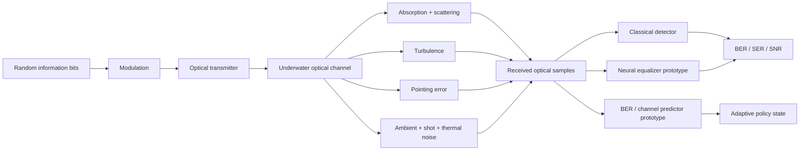
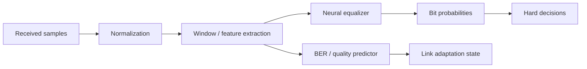

# OpenUWOC-AI

<p align="center">
  <strong>Simulation-first AI for robust underwater optical wireless communication.</strong>
</p>

<p align="center">
  
  
  
  
  
</p>

## Research vision

**OpenUWOC-AI** is a research framework for studying how artificial intelligence can improve the robustness, reliability, and adaptability of **underwater optical wireless communication (UWOC)** links.

The repository combines interpretable physical-channel simulation, deterministic experiment configurations, classical optical communication baselines, and prototype neural receivers. It is designed for research in marine robotics, underwater sensor networks, autonomous underwater vehicles, and adaptive communication systems.

> **Central research question**  
> How can data-driven receivers and adaptive policies improve UWOC performance under absorption, scattering, turbulence, platform misalignment, ambient light, and receiver noise?

All current outputs are **simulation results**. The repository does not claim physical validation, deployment readiness, or state-of-the-art performance.

---

## Why this matters

Underwater optical links can provide high-rate, low-latency communication over short and medium ranges, complementing slower acoustic systems. Their performance, however, can degrade rapidly due to:

- wavelength-dependent absorption;
- particle scattering and turbidity;
- turbulence-induced irradiance fluctuations;
- pointing errors caused by AUV/ROV motion;
- ambient optical background;
- shot and thermal receiver noise;
- partial or uncertain channel knowledge.

Classical analytical models remain essential, but fixed receivers may not adapt well when several impairments interact. AI can support equalization, channel-quality prediction, modulation adaptation, and failure detection—provided it is evaluated against transparent baselines under reproducible assumptions.

---

## Core research contributions

| Contribution | Description |
|---|---|
| Simulation-first UWOC channel | Modular absorption, scattering, turbulence, pointing-loss, and noise models |
| Reproducible experiment layer | YAML-driven runs with deterministic seeds and exported metrics |
| Classical communication baseline | OOK modulation and threshold detection |
| Statistical evaluation | BER, SER, approximate SNR, and Wilson confidence intervals |
| Prototype AI receiver | Small neural equalizer for controlled experiments |
| Prototype link predictor | Neural BER/channel-quality prediction interface |
| Code-generated research assets | Figures, GIF, and video outputs generated from experiment data |
| Claim-disciplined research structure | Explicit separation of implemented, prototype, and planned capabilities |

---

## System architecture



---

## Channel formulation

The baseline assumes intensity modulation with direct detection. The received sample is modeled as

```math
y_k = h_k P_t[k] + P_{amb} + n_{shot,k} + n_{th,k},
```

where the effective channel gain is

```math
h_k = \exp[-(a(\lambda)+b(\lambda))d]\,h_p(k)\,h_t(k).
```

Here:

- `a(λ)` is the absorption coefficient;
- `b(λ)` is the scattering coefficient;
- `d` is link distance;
- `h_p(k)` represents pointing loss;
- `h_t(k)` represents turbulence-induced fading;
- `P_amb` is ambient optical power;
- `n_shot` and `n_th` are receiver noise terms.

The model is deliberately modular so that individual impairments and interactions can be studied through controlled ablations. Detailed notation and assumptions are documented in `docs/MATHEMATICAL_FORMULATION.md`.

---

## AI receiver concept



The neural components are currently **research prototypes**. Their purpose is to support controlled comparisons against classical receivers—not to imply demonstrated superiority.

---

## Implemented, prototype, and planned scope

| Area | Status | Evidence / notes |
|---|---:|---|
| Beer–Lambert attenuation | Implemented | wavelength and water-profile attenuation model |
| Water-type presets | Implemented | clear ocean, coastal, and turbid harbor scenarios |
| Pointing-error model | Implemented | Gaussian pointing-loss scaffold |
| Turbulence model | Prototype | unit-mean lognormal fading scaffold |
| Thermal and shot noise | Implemented | receiver-noise approximations |
| OOK modulation | Implemented | symbol mapping and threshold detector |
| BER / SER / SNR metrics | Implemented | includes Wilson confidence intervals |
| YAML experiment runner | Implemented | deterministic seeds and CSV output |
| Neural equalizer | Prototype | small PyTorch MLP |
| BER predictor | Prototype | small PyTorch MLP |
| Adaptive modulation policy | Prototype / planned | rule-based proxy only in current scope |
| BPSK, QPSK, M-QAM, OFDM | Planned | modulation API extension required |
| Matched and linear equalizers | Planned | needed for stronger classical baselines |
| Real tank or field dataset | Planned | no measured data committed |
| Hardware-in-the-loop link | Planned | transmitter/receiver integration pending |

---

## Installation

```bash
git clone https://github.com/panagiotagrosdouli/OpenUWOC-AI.git
cd OpenUWOC-AI
python -m venv .venv
source .venv/bin/activate
pip install -e '.[dev]'
```

Install the PyTorch-based AI prototypes:

```bash
pip install -e '.[ai]'
```

---

## Quick start

```python
from openuwoc_ai.channel.models import ChannelConfig, UnderwaterOpticalChannel, WaterType
from openuwoc_ai.modulation.ook import bits_to_ook, random_bits, threshold_detect
from openuwoc_ai.evaluation.metrics import bit_error_rate

bits = random_bits(1000, seed=7)
tx = bits_to_ook(bits, optical_power_w=1.0)

channel = UnderwaterOpticalChannel(
    ChannelConfig(
        water_type=WaterType.COASTAL,
        distance_m=10.0,
    )
)

rx = channel.propagate(tx)
estimated = threshold_detect(rx)
print(bit_error_rate(bits, estimated))
```

---

## Reproducible experiment

```bash
python scripts/run_experiment.py \
  configs/coastal_ook_baseline.yaml \
  --output results/coastal_ook_baseline.csv
```

Run tests:

```bash
pytest
```

Generate the demo media:

```bash
python scripts/make_demo_gif.py
```

Expected outputs include:

```text
assets/demo.gif
results/videos/demo.mp4
results/*.csv
```

The animation is illustrative and code-generated. It is not physical measurement evidence.

---

## Experimental protocol

A rigorous UWOC experiment should vary one or more of the following:

| Factor | Example conditions |
|---|---|
| Water type | clear ocean, coastal, turbid harbor |
| Distance | short to progressively attenuated links |
| Optical power | controlled transmitter-power sweep |
| Turbulence | weak to stronger fading parameters |
| Misalignment | pointing-error variance or displacement |
| Ambient light | low-background to high-background conditions |
| Receiver noise | thermal and shot-noise levels |
| Receiver | threshold detector, classical equalizer, neural equalizer |

Each experiment should record the full configuration, random seed, number of transmitted bits, receiver type, and confidence interval.

---

## Evaluation metrics

| Category | Measures |
|---|---|
| Link reliability | Bit Error Rate and Symbol Error Rate |
| Signal quality | approximate SNR and received-power statistics |
| Statistical confidence | Wilson confidence interval for finite-bit trials |
| Robustness | degradation across distance, water type, turbulence, noise, and pointing error |
| AI comparison | BER gain/loss relative to classical receivers |
| Generalization | performance on channel conditions unseen during training |
| Deployment | inference latency, parameter count, memory, and energy when measured |

A fair AI result must compare models using the same transmitted bits, channel seeds, channel conditions, and metric definitions.

---

## Recommended baseline matrix

| Receiver | Role | Current status |
|---|---|---:|
| Fixed threshold detector | transparent OOK baseline | Implemented |
| Oracle threshold | upper diagnostic baseline | Recommended |
| Adaptive threshold | classical adaptive baseline | Planned |
| Linear equalizer | channel-compensation baseline | Planned |
| Neural equalizer | data-driven receiver | Prototype |
| BER predictor | link-quality estimator | Prototype |

---

## Reproducibility principles

- Keep physical assumptions explicit and version-controlled.
- Use deterministic seeds for synthetic trials.
- Commit experiment configs with every reported table.
- Report confidence intervals, not only point estimates.
- Compare AI receivers against meaningful classical baselines.
- Separate simulation validation from physical validation.
- Avoid claims across water types or hardware not represented in training and evaluation.

---

## Limitations

- Current evidence is simulation-only.
- Water coefficients are presets and require calibration before physical interpretation.
- Turbulence, pointing, and noise models simplify real underwater propagation.
- Multipath, receiver bandwidth, optical filtering, and hardware nonlinearities are not fully modeled.
- Neural models are small prototypes and have not been compared against a complete classical receiver suite.
- No tank, pool, sea-trial, or hardware-in-the-loop dataset is currently committed.
- The project does not claim state-of-the-art performance.

---

## Research roadmap

1. Strengthen the classical receiver baseline suite.
2. Add modulation families beyond OOK.
3. Introduce channel-estimation and equalization benchmarks.
4. Evaluate neural receivers under unseen water and noise conditions.
5. Develop uncertainty-aware link-quality prediction.
6. Add adaptive modulation and optical-power control.
7. Acquire calibrated tank-based data.
8. Study sim-to-real transfer and hardware deployment.
9. Integrate the communication policy with AUV/ROV mission planning.

---

## MSc / PhD research directions

- physics-informed neural equalization;
- robust learning across unseen water types;
- joint channel estimation and detection;
- uncertainty-calibrated BER prediction;
- adaptive modulation and optical-power control;
- motion-aware pointing compensation for AUVs and ROVs;
- hybrid acoustic–optical communication policies;
- sim-to-real transfer using tank and sea-trial measurements;
- communication-aware robotic path planning.

---

## Responsible scientific use

This repository is intended as research software and an experimental scaffold. Simulation outputs should not be presented as verified underwater-link performance. Any publication-quality claim should include calibrated parameters, classical baselines, repeated trials, confidence intervals, complete configs, and—where relevant—physical measurements.

---

## Citation

Until a peer-reviewed manuscript and physical validation are available, cite the repository as simulation software:

```bibtex
@software{grosdouli_openuwoc_ai_2026,
  author = {Grosdouli, Panagiota},
  title = {OpenUWOC-AI: Simulation-First Artificial Intelligence for Underwater Optical Wireless Communication},
  year = {2026},
  url = {https://github.com/panagiotagrosdouli/OpenUWOC-AI},
  note = {Research prototype; simulation-only results}
}
```

See `CITATION.cff` for repository citation metadata.

## License

MIT License. See `LICENSE`.