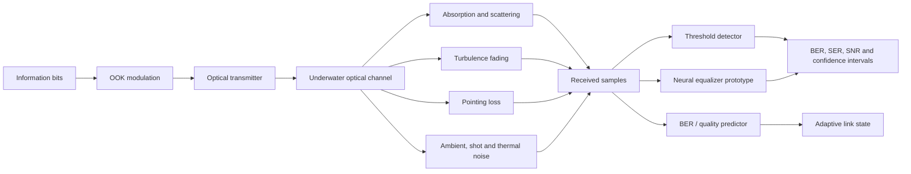

<div align="center">

# OpenUWOC-AI

## Τεχνητή Νοημοσύνη με Προτεραιότητα στην Προσομοίωση για Υποβρύχιες Οπτικές Ασύρματες Επικοινωνίες

Ένα αναπαραγώγιμο ερευνητικό framework σε Python για physics-informed προσομοίωση UWOC, κλασικούς receivers, prototype neural receivers και προσαρμοστική αξιολόγηση ποιότητας σύνδεσης.

[](pyproject.toml)
[](#ερευνητικό-πρόβλημα)
[](#επαληθευμένο-πεδίο)
[](LICENSE)

[English](README.md) · **Ελληνικά**

</div>

<p align="center">
  
</p>

<p align="center"><em>Εννοιολογική επισκόπηση του repository. Το διάγραμμα περιγράφει τη ροή προσομοίωσης και αξιολόγησης· δεν αποτελεί απόδειξη tank test, sea trial, hardware-in-the-loop ή παραγωγικής λειτουργίας.</em></p>

## Περίληψη

Η υποβρύχια οπτική ασύρματη επικοινωνία (Underwater Optical Wireless Communication, UWOC) μπορεί να προσφέρει υψηλό ρυθμό μετάδοσης και χαμηλή καθυστέρηση σε θαλάσσια ρομπότ και υποβρύχια δίκτυα αισθητήρων. Η αξιοπιστία της, όμως, επηρεάζεται έντονα από απορρόφηση, σκέδαση, τύρβη, σφάλματα στόχευσης, περιβαλλοντικό φωτισμό και θόρυβο του δέκτη. Το OpenUWOC-AI μελετά κατά πόσο data-driven receivers και predictors ποιότητας σύνδεσης μπορούν να βελτιώσουν την ανθεκτικότητα υπό αυτούς τους αλληλεπιδρώντες παράγοντες, χωρίς να χάνεται η σύγκριση με διαφανή φυσικά και κλασικά baselines.

Το repository συνδυάζει modular προσομοίωση υποβρύχιου οπτικού καναλιού, deterministic experiment configurations, on-off keying, threshold detection, finite-sample communication metrics και prototype PyTorch models για neural equalization και BER prediction. Η βασική συνεισφορά δεν είναι ένας ισχυρισμός ανωτερότητας της AI, αλλά ένα traceable ερευνητικό scaffold όπου οι φυσικές παραδοχές, τα random seeds, οι receivers, οι μετρικές και τα generated artifacts παραμένουν ρητά και ελέγξιμα.

Όλα τα τρέχοντα αποτελέσματα είναι **simulation-only**. Δεν διεκδικείται φυσική βαθμονόμηση καναλιού, tank ή sea-trial validation, production readiness ή state-of-the-art επίδοση.

---

## Ερευνητικό πρόβλημα

> **Πώς μπορούν κλασικοί και data-driven receivers να διατηρούν αξιόπιστες UWOC συνδέσεις όταν αλλάζουν ο τύπος νερού, η απόσταση, η τύρβη, η κίνηση της πλατφόρμας, το optical background και η γνώση του καναλιού;**

Η απάντηση απαιτεί τρία επίπεδα συλλογισμού:

1. **Φυσική διάδοση:** Τι σήμα φτάνει στον δέκτη μετά από attenuation, fading, pointing loss και θόρυβο;
2. **Receiver inference:** Πώς πρέπει να ανακατασκευαστούν τα transmitted symbols από degraded observations;
3. **Link adaptation:** Πότε πρέπει να αλλάξει receiver, modulation, optical power ή mission policy;

Το OpenUWOC-AI επικεντρώνεται κυρίως στα δύο πρώτα επίπεδα και παρέχει prototype interfaces για το τρίτο.

---

## Γιατί η UWOC είναι δύσκολη

Η απόδοση μπορεί να υποβαθμιστεί από:

- wavelength-dependent absorption,
- particle scattering και turbidity,
- turbulence-induced irradiance fluctuations,
- κίνηση AUV/ROV και pointing misalignment,
- ambient optical background,
- shot και thermal noise,
- περιορισμούς bandwidth και nonlinearities,
- διαφορά μεταξύ simulated και physical water conditions.

Ένας neural receiver έχει επιστημονική αξία μόνο όταν συγκρίνεται με ισχυρά classical baselines, χρησιμοποιώντας τα ίδια transmitted bits, channel conditions, random seeds και metric definitions.

---

## Αρχιτεκτονική συστήματος



Η αρχιτεκτονική διαχωρίζει σκόπιμα το physical-channel model, το receiver inference και την αξιολόγηση, ώστε κάθε στοιχείο να μπορεί να αντικατασταθεί ή να εξεταστεί με ablation.

---

## Μαθηματική διατύπωση

Η baseline διατύπωση υποθέτει intensity modulation with direct detection. Το received sample μοντελοποιείται ως

```math
y_k = h_k P_t[k] + P_{amb} + n_{shot,k} + n_{th,k},
```

με effective channel gain

```math
h_k = \exp[-(a(\lambda)+b(\lambda))d]h_p(k)h_t(k).
```

όπου:

- `a(λ)` είναι ο absorption coefficient,
- `b(λ)` είναι ο scattering coefficient,
- `d` είναι η απόσταση σύνδεσης,
- `h_p(k)` είναι το pointing loss,
- `h_t(k)` είναι το turbulence fading,
- `P_amb` είναι το ambient optical power,
- `n_shot,k` και `n_th,k` είναι όροι receiver noise.

Για transmitted bits `b_k` και αποφάσεις `b̂_k`, το Bit Error Rate ορίζεται ως

```math
\mathrm{BER}=\frac{1}{N}\sum_{k=1}^{N}\mathbf{1}[b_k\neq\hat b_k].
```

Σε finite trials πρέπει να αναφέρονται confidence intervals και όχι μόνο point estimates. Η τρέχουσα υλοποίηση περιλαμβάνει Wilson intervals.

---

## Ερευνητικές συνεισφορές

| Συνεισφορά | Τρέχων ρόλος |
|---|---|
| Modular physical-channel simulation | Διαχωρίζει attenuation, turbulence, pointing loss, ambient light και receiver noise |
| Deterministic experiments | YAML configurations, explicit seeds και CSV outputs |
| Classical receiver baseline | OOK με transparent threshold detector |
| Statistical evaluation | BER, SER, approximate SNR και Wilson intervals |
| Neural equalizer prototype | Μικρό PyTorch MLP για controlled comparisons |
| BER / quality predictor prototype | Data-driven interface για μελλοντικό link adaptation |
| Generated research artifacts | Figures, GIF, video και tables από κώδικα |
| Claim-disciplined documentation | Ρητός διαχωρισμός implemented, prototype, planned και physically unvalidated στοιχείων |

---

## Επαληθευμένο πεδίο

| Περιοχή | Κατάσταση | Όριο τεκμηρίωσης |
|---|---:|---|
| Beer–Lambert attenuation | Υλοποιημένο | Simulation model |
| Clear, coastal, turbid presets | Υλοποιημένο | Configured coefficients, όχι field calibration |
| Pointing-error model | Υλοποιημένο | Gaussian-loss scaffold |
| Turbulence model | Prototype | Unit-mean lognormal scaffold |
| Thermal και shot noise | Υλοποιημένο | Receiver-noise approximation |
| OOK και threshold detector | Υλοποιημένο | Classical synthetic baseline |
| BER, SER, SNR, Wilson interval | Υλοποιημένο | Finite synthetic trials |
| YAML experiment runner | Υλοποιημένο | Deterministic configuration και CSV export |
| Neural equalizer | Prototype | Μικρό PyTorch model |
| BER predictor | Prototype | Μικρό PyTorch model |
| Adaptive modulation / power control | Planned / prototype interface | Χωρίς validated policy claim |
| BPSK, QPSK, QAM, OFDM | Planned | Δεν αποτελούν reportable baselines |
| Tank, pool ή sea-trial data | Μη διαθέσιμα | Δεν υπάρχει physical validation claim |
| Hardware-in-the-loop link | Planned | Εκκρεμεί transmitter/receiver integration |

---

## Εγκατάσταση

```bash
git clone https://github.com/panagiotagrosdouli/OpenUWOC-AI.git
cd OpenUWOC-AI
python -m venv .venv
source .venv/bin/activate
python -m pip install --upgrade pip
python -m pip install -e ".[dev]"
```

Για τα προαιρετικά PyTorch prototypes:

```bash
python -m pip install -e ".[ai]"
```

Windows PowerShell:

```powershell
.venv\Scripts\Activate.ps1
python -m pip install -e ".[dev]"
```

---

## Γρήγορη εκκίνηση

```python
from openuwoc_ai.channel.models import ChannelConfig, UnderwaterOpticalChannel, WaterType
from openuwoc_ai.evaluation.metrics import bit_error_rate
from openuwoc_ai.modulation.ook import bits_to_ook, random_bits, threshold_detect

bits = random_bits(1000, seed=7)
tx = bits_to_ook(bits, optical_power_w=1.0)
channel = UnderwaterOpticalChannel(
    ChannelConfig(water_type=WaterType.COASTAL, distance_m=10.0)
)
rx = channel.propagate(tx)
estimated = threshold_detect(rx)
print(bit_error_rate(bits, estimated))
```

Εκτέλεση του documented experiment:

```bash
python scripts/run_experiment.py \
  configs/coastal_ook_baseline.yaml \
  --output results/coastal_ook_baseline.csv
```

Tests και media generation:

```bash
pytest
python scripts/make_demo_gif.py
```

Αναμενόμενα generated outputs:

```text
assets/demo.gif
results/videos/demo.mp4
results/*.csv
```

Τα media είναι επεξηγηματικά simulation artifacts και όχι physical measurements.

---

## Πειραματικό πρωτόκολλο

Μια αυστηρή σύγκριση πρέπει να μεταβάλλει ελεγχόμενα:

| Παράγοντας | Παραδείγματα |
|---|---|
| Water type | clear ocean, coastal, turbid harbor |
| Distance | short έως strongly attenuated links |
| Optical power | controlled transmitter-power sweep |
| Turbulence | weak έως stronger fading |
| Misalignment | pointing displacement ή variance |
| Ambient light | low έως high optical background |
| Receiver noise | thermal και shot-noise levels |
| Receiver | threshold, classical equalizer, neural equalizer |

Κάθε reportable experiment πρέπει να διατηρεί:

- configuration file,
- random seed,
- transmitted-bit sequence ή generation seed,
- αριθμό transmitted symbols,
- receiver method και hyperparameters,
- software revision,
- output tables και figures,
- confidence interval για finite trials.

---

## Μετρικές αξιολόγησης

| Κατηγορία | Μετρικές |
|---|---|
| Reliability | BER και SER |
| Signal quality | approximate SNR και received-power summaries |
| Statistical confidence | Wilson interval |
| Robustness | degradation ως προς water, distance, turbulence, noise και pointing error |
| Receiver comparison | gain ή loss έναντι ίδιων classical baselines |
| Generalization | επίδοση σε unseen channel conditions |
| Deployment research | latency, memory, parameter count και energy όταν μετρώνται |

Δεν πρέπει να περιγράφεται ένας AI receiver ως καλύτερος χωρίς σύγκριση στα ίδια bits και στις ίδιες channel realizations.

---

## Δομή repository

```text
openuwoc_ai/        channel, modulation, receiver και evaluation modules
configs/            reproducible experiment configurations
scripts/            experiment και media entry points
tests/              automated tests
docs/               formulation, assumptions και research documentation
assets/              explanatory και generated visual assets
results/             generated tables, videos και experimental artifacts
```

---

## Περιορισμοί

- Η τρέχουσα τεκμηρίωση είναι simulation-only.
- Οι water coefficients είναι configured presets και χρειάζονται physical calibration.
- Turbulence, pointing, noise, multipath, bandwidth, filtering και hardware nonlinearities απλοποιούνται.
- Τα neural models είναι μικρά research prototypes.
- Η classical receiver suite δεν είναι ακόμη πλήρης.
- Δεν υπάρχει committed tank, pool, sea-trial ή hardware-in-the-loop dataset.
- Δεν έχει τεκμηριωθεί simulation-to-real generalization.
- Δεν διεκδικείται state-of-the-art επίδοση ή deployment readiness.

---

## Ερευνητικός οδικός χάρτης

1. Προσθήκη adaptive-threshold, matched-filter και linear-equalizer baselines.
2. Επέκταση modulation πέρα από OOK.
3. Joint benchmarking channel estimation και equalization.
4. Αξιολόγηση neural receivers σε held-out water και noise distributions.
5. Calibration uncertainty-aware BER και channel-quality predictors.
6. Adaptive modulation και optical-power control.
7. Απόκτηση calibrated tank measurements.
8. Sim-to-real και hardware-in-the-loop evaluation.
9. Σύνδεση communication policy με AUV/ROV mission planning.

---

## Υπεύθυνη επιστημονική χρήση

Το OpenUWOC-AI είναι ερευνητικό λογισμικό. Τα simulation outputs δεν πρέπει να παρουσιάζονται ως verified underwater-link performance. Publication-quality claims απαιτούν calibrated assumptions, repeated trials, confidence intervals, ισχυρά classical baselines, πλήρη configurations και physical measurements όπου είναι απαραίτητα.

---

## Αναφορά

```bibtex
@software{grosdouli_openuwoc_ai_2026,
  author = {Grosdouli, Panagiota},
  title = {OpenUWOC-AI: Simulation-First Artificial Intelligence for Underwater Optical Wireless Communication},
  year = {2026},
  url = {https://github.com/panagiotagrosdouli/OpenUWOC-AI},
  note = {Research prototype; simulation-only results}
}
```

Δείτε το [`CITATION.cff`](CITATION.cff) για τα repository metadata.

## Άδεια

Διανέμεται με MIT License. Δείτε το [`LICENSE`](LICENSE).