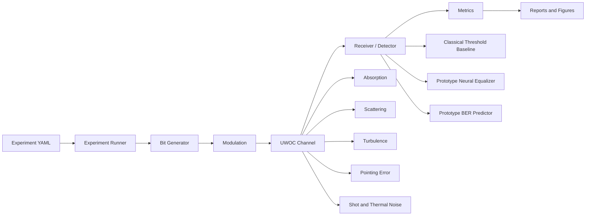
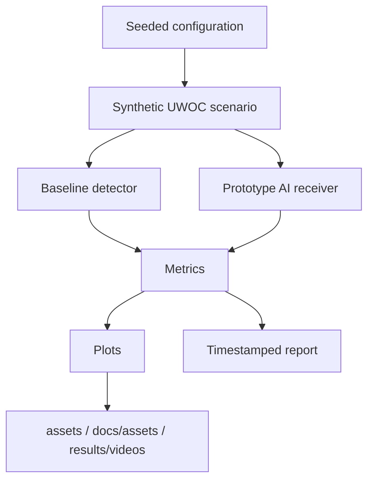

# OpenUWOC-AI Architecture

OpenUWOC-AI follows a modular research-software architecture. Each component should be independently testable, documented, and replaceable.

## Core Layers

### 1. Environment Layer

Defines the physical underwater context:

- water type;
- absorption coefficient;
- scattering coefficient;
- turbulence strength;
- background noise;
- future wavelength-dependent parameters.

### 2. Channel Layer

Models the optical wireless link:

- attenuation;
- scattering;
- turbulence;
- beam divergence;
- receiver aperture;
- pointing error;
- mobility.

The current implementation contains a baseline line-of-sight channel model.

### 3. AI Layer

Provides interfaces for AI-powered optimization and prediction:

- supervised channel prediction;
- reinforcement learning for link adaptation;
- graph neural networks for network optimization;
- generative models for synthetic channel generation;
- anomaly detection for secure UWOC.

### 4. Digital Twin Layer

Maintains a virtual representation of the UWOC system. The long-term objective is to synchronize simulation data, observed data, and predictive AI models.

### 5. Optimization Layer

Supports intelligent decision-making for:

- beam alignment;
- resource allocation;
- routing;
- power control;
- energy efficiency;
- adaptive modulation and coding.

### 6. Experiment Layer

Provides reproducible experiment execution using:

- configuration files;
- logging;
- exported results;
- deterministic seeds;
- benchmark scenarios.

## End-to-End Pipeline

## Research Artifact Pipeline

## Design Rule

The simulator should not depend on a specific AI model. AI modules should consume clean data structures from the simulator and return actions, predictions, or optimized parameters through stable interfaces.

## Reproducibility Rules

- Keep channel modelling separate from receiver modelling.
- Keep synthetic data generation reproducible and explicitly labelled.
- Keep benchmark tables honest by marking unavailable baselines as `Pending`.
- Keep generated visualizations reproducible from scripts.
- Keep AI components optional until dependencies and evaluation budgets are defined.
